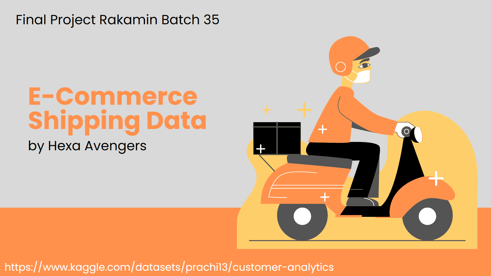

# **Hexa Avengers (E-Commerce Shipping Data)**

# **Introduction**
## Problem

PT. Avengers merupakan perusahaan di bidang e-commerce yang sudah memiliki 10.999 transaksi. Namun terdapat temuan bahwa sebanyak 6.563 (59.6%) transaksi mengalami keterlambatan hal ini diduga akan mempengaruhi satisfaction customer.

## Peran
Project Leader: Kevin Usmayadhy Wijaya\
Data Analyst: Vicky Clarissa Jennie Damara\
Data Scientist : Nabil Abduh Aqil\
Machine Learning Engineer: Febiya Jomy Pratiwi\
Business Analyst: Qistina Muharrifa & Riel Jeremy Jordan Umboh

## Goal
Goal yang ingin dicapai adalah menurunkan persentase keterlambatan barang

## Objective
- Membuat model klasifikasi yang bisa memprediksi keterlambatan barang
- Mencari faktor-faktor yang mempengaruhi keterlambatan

## Business Metrics
Late Rate (Persentase Keterlambatan)

# **Data Understanding**

Dataset yang digunakan merupakan dataset [E-Commerce Shipping Data](https://www.kaggle.com/datasets/prachi13/customer-analytics) yang diambil dari kaggle yang terdiri dari 10999 baris dan 12 kolom. Kolom pada dataset ini terdiri dari:
- **ID**: ID Number of Customers.
- **Warehouse block**: The Company have big Warehouse which is divided in to block such as A,B,C,D,E.
- **Mode of shipment**:The Company Ships the products in multiple way such as Ship, Flight and Road.
- **Customer care calls**: The number of calls made from enquiry for enquiry of the shipment.
- **Customer rating**: The company has rated from every customer. 1 is the lowest (Worst), 5 is the highest (Best).
- **Cost of the product**: Cost of the Product in US Dollars.
- **Prior purchases**: The Number of Prior Purchase.
- **Product importance**: The company has categorized the product in the various parameter such as low, medium, high.
- **Gender**: Male and Female.
- **Discount offered**: Discount offered on that specific product.
- **Weight in gms**: It is the weight in grams.
- **Reached on time**: It is the target variable, where 1 Indicates that the product has NOT reached on time and 0 indicates it has reached on time.

# **Data Preprocessing**
Proses pembersihan dan penyesuaian data yang dilakukan adalah handling outlier, fitur scaling, dan fitur encoding. Kemudian dilanjutkan fitur selection dan splitting data.

# **Modelling**
Algoritma Machine Learning (ML) digunakan untuk memprediksi keterlambatan barang dengan model diantaranya adalah Logistic Regression, KNN, Decision Tree, Random Forest, AdaBoost, dan XGBoost. Diantara model tersebut Logistic Regression memiliki performa terbaik untuk data ini.

# **About**
Repositori ini terdiri dari beberapa folder, berikut penjelasan dari masing-masing folder:
- Code: berisikan source code jupyter notebook
- Dokumen: berisikan laporan penjelasan keseluruhan project dan ppt presentasi
- E-Commerce_Shipping_Dataset: berisikan dataset yang digunakan
- img: berisikan gambar introduction